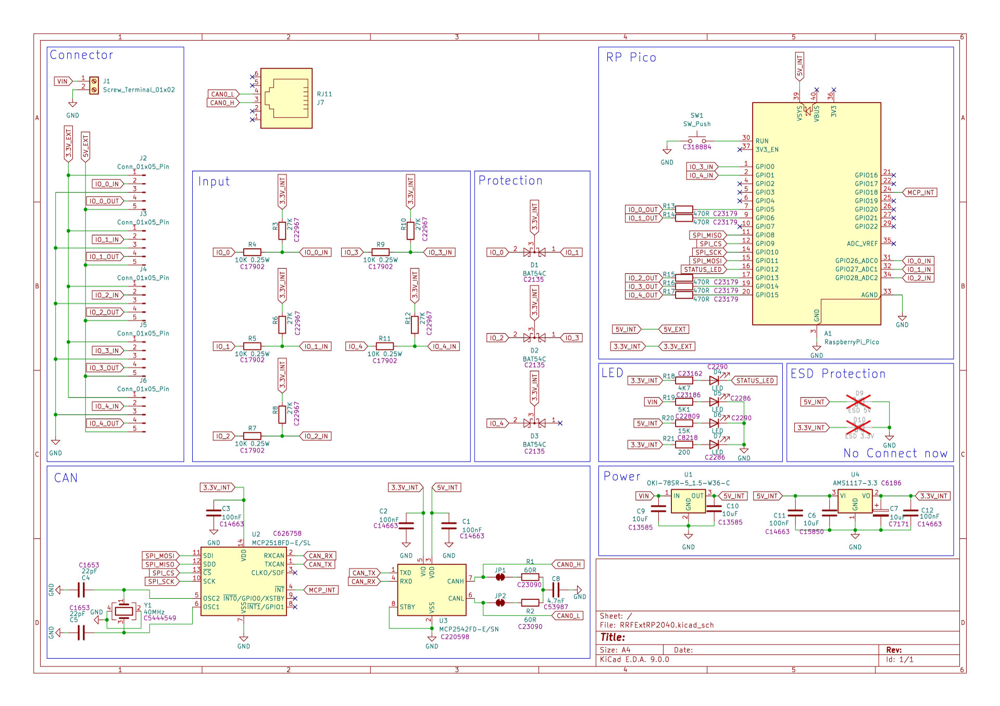
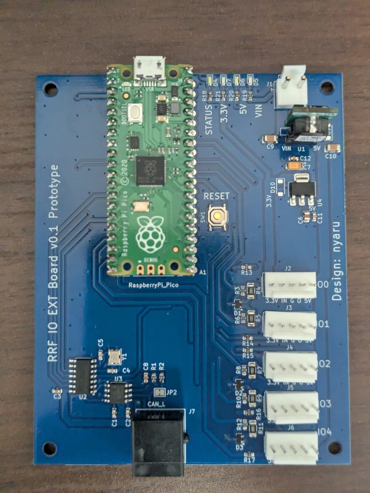

# RP2040 CAN IO Expansion Board
This is a CAN-connected I/O expansion board for Duet3 (RepRapFirmware) using the RP2040 and MCP2518FD.
The circuit design was heavily inspired by the [Duet3 Mainboard 6HC](https://github.com/Duet3D/Duet3-Mainboard-6HC) and the [Fly-RRF-36](https://github.com/Mellow-3D/Fly-RRF-36).

---

# RP2040 CAN IO Expansion Board
RP2040 + MCP2518FD を使用した、Duet3 (RepRapFirmware) 向けの CAN 接続 IO 拡張基板です。
回路設計は[Duet3 Mainboard 6HC](https://github.com/Duet3D/Duet3-Mainboard-6HC)と[Fly-RRF-36](https://github.com/Mellow-3D/Fly-RRF-36)を大いに参考にしました。

# プロトタイプ

